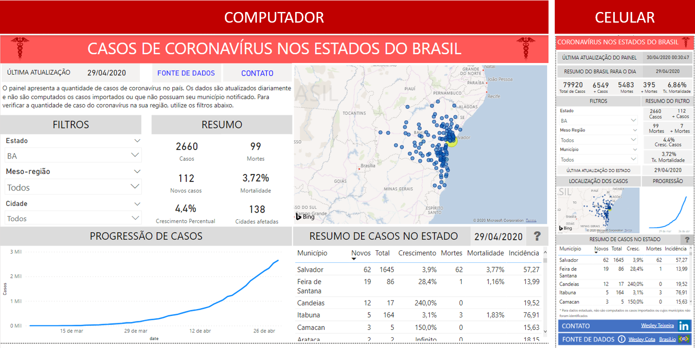
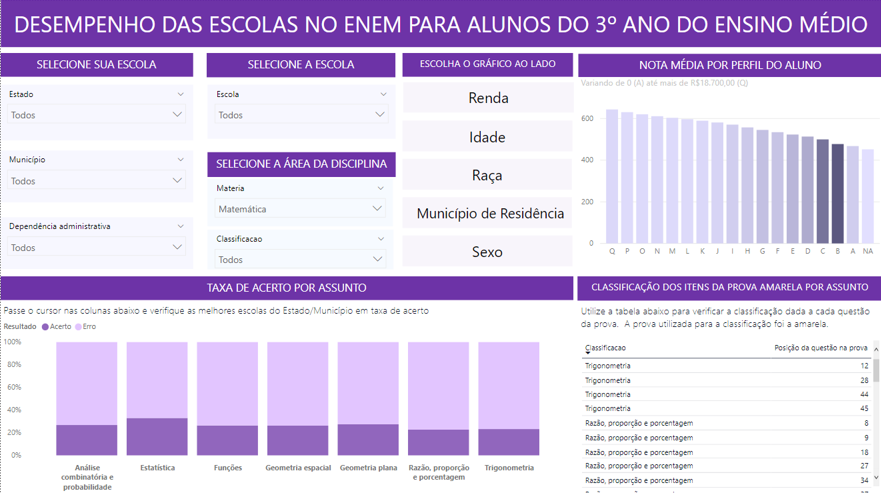

#
#
#

```{r setup, echo=FALSE, message=FALSE, warning=FALSE}
library(tidyverse)
library(knitr)
```


## **Painel de monitoramento do Coronavírus**
#
### Este painel tem como objetivo a visualização dos dados referentes ao COVID-19. Os dados foram obtidos a partir do site Brasil.io e do repositório de dados elaborado por Wesley Cota. O painel foi elaborado tanto para uma versão de computados, como para uma versão de celular.
#
### [Painel Computador](https://bit.ly/CoronavirusPC)

### [Painel Celular](https://bit.ly/coronavirusmobile)

#
```{r corona, fig.align='center', fig.cap="Imagens dos Painéis", out.width="100%", echo=FALSE}

```

#
#
#

## **Painel de desempenho das escolas no ENEM 2017**

### Com o intuito de fornecer insumos às escolas sobre o desempenho de seus alunos no ENEM, foi elaborado um painel que identifica o percentual de acertos de seus alunos em cada área de uma disciplina do ENEM. Diferentemente das informações disponibilizadas pelo INEP, aqui a escola encontra não somente o resultado geral dos seus alunos (nota média nas grandes áreas), mas destrincha essas informações para cada área de conhecimento de uma disciplina.
#
### Para a realização da classificação das questões, foi utilizada como base uma list de exercícios divulgada pelo grupo exatas.
#
### [Painel Enem](https://bit.ly/Enempainel_2017)

#
```{r enem, fig.align='center', fig.cap="Painel", out.width="100%", echo=FALSE}

```