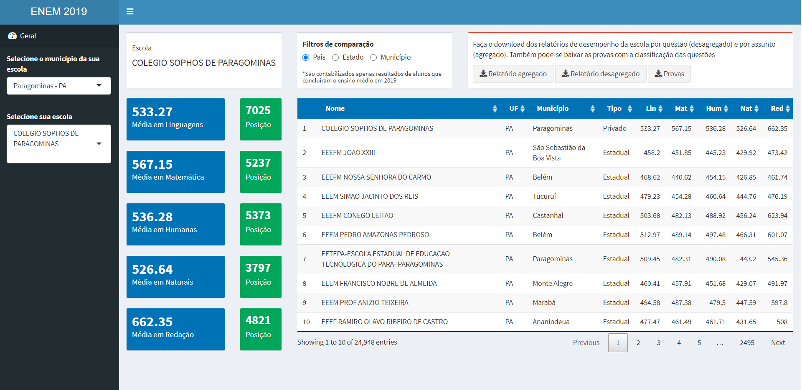

---	
title: "Painel Shiny"	
---	

```{r setup, echo=FALSE, message=FALSE, warning=FALSE}	
library(tidyverse)	
library(knitr)	
```	
#
#
#
### **Painel de desempenho das escolas no ENEM em Shiny**	
#	
#### Diferentemente do painel apresentado na aba Painéis, não utilizei o Power BI para realizá-lo e sim o Shiny. O Shiny é um pacote do R para a criação de diversos tipos de relatórios. Como principal vantagem que possui em relação a outras ferramentas do mercado (Power BI, Qlik View e Tableau), ele é altamente flexível e, o melhor de tudo, gratuito. Como você mesmo desenvolve a sua própria aplicação, para seu funcionamento basta possuir um servidor que pode ser até seu computador.	

#### Como citado, outra vantagem que ele possui é a sua flexibilidade. Nele é possível inserir análises complexas e pode ser utilizado qualquer pacote estatístico do R para isso. Assim, testes estatísticos, machine learning ou gráficos dinâmicos são algumas das opções possíveis de serem usados. Como se não bastasse, a interação com o usuário pode ser muito maior. Nele, posso solicitar para o usuário fazer o upload de algum arquivo a fim do aplicativo utilizar essas informações para realizar suas análises. Outra possibilidade é a permissão de download de relatórios. Assim, o usuário seleciona alguns parâmetros na fermenta e o app possibilita que ele faça o download de um relatório personalizado à solicitação do usuário.	

#### As possibilidades são variadas. Aqui trago apenas um pouco do que estou aprendendo.	
#	
### [Confira o Painel](https://wesleyst.shinyapps.io/ENEM/)	

#	
```{r corona, fig.align='center', fig.cap="Painel", out.width="100%", echo=FALSE}	
	
```